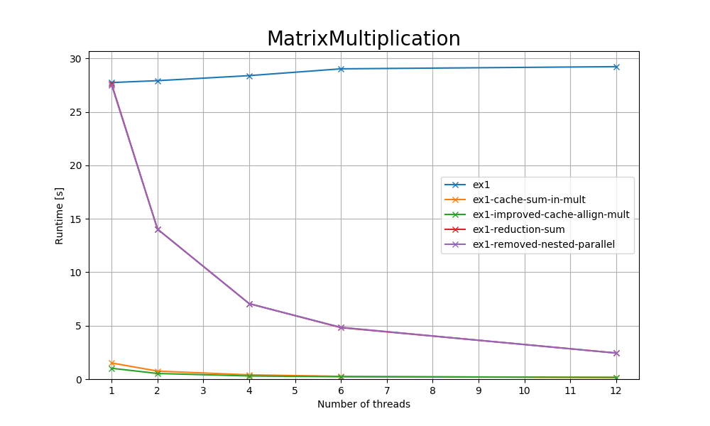

## Exercise 1 (1.5 Points)

### Description

This exercise deals with performance analysis and improvement of a given code [ex1/ex1.c](ex1/ex1.c). The program reads a matrix size n from the command-line. Then two square matrices a and b of size n\*n are filled with random numbers. Finally, the program should print the sum of all elements of matrix c and the wall clock time after the matrix multiplication c=a\*b was conducted.

### Tasks

1) Are there any (performance) issues in the given code? Document your findings.
    -  One of the main issue was the race condition when executing the original code. We have two #pragma omp for sections but the keyword `ordered` where missing. That means there were cases when there where still some work to do in the multiplication loop but the sum loop already started.
    - For the performance issues, see `2)`
2) Improve the performance of the given source code.
    - Removed-nested-parallel(race conditions)
        - Removed the multiple nested shared variables declarations.
    - Reduction-sum
        - The time did not improve but the race condition was removed.
    - Improved-cache-allign-mult(most effective)
        - Changed the j and k in the multiplication loops for better cache performance.
    - Cache-sum-in-multi
        - No further improvements here.
3) Benchmark your modification of the code and the original implementation with 1, 2, 4, 6, and 12 threads on LCC3 using n=1,500. Has your effort paid off?
    - Yes, see results
4) Enter your shortest wall clock time for 12 threads and n=1,500 on LCC3 to the comparison spreadsheet linked on Discord.
    - Done

| num_threads | ex1 | ex1-cache-sum-in-mult | ex1-improved-cache-allign-mult | ex1-reduction-sum | ex1-removed-nested-parallel |
|---|---|---|---|---|---|
| 1 | 27.741s | 1.511s | 1.016s | 27.593s | 27.494s |
| 2 | 27.916s | 0.752s | 0.530s | 14.030s | 14.024s |
| 4 | 28.388s | 0.402s | 0.298s | 7.059s | 7.059s |
| 6 | 29.023s | 0.260s | 0.226s | 4.819s | 4.847s |
| 12 | 29.226s | 0.157s | 0.163s | 2.447s | 2.434s |