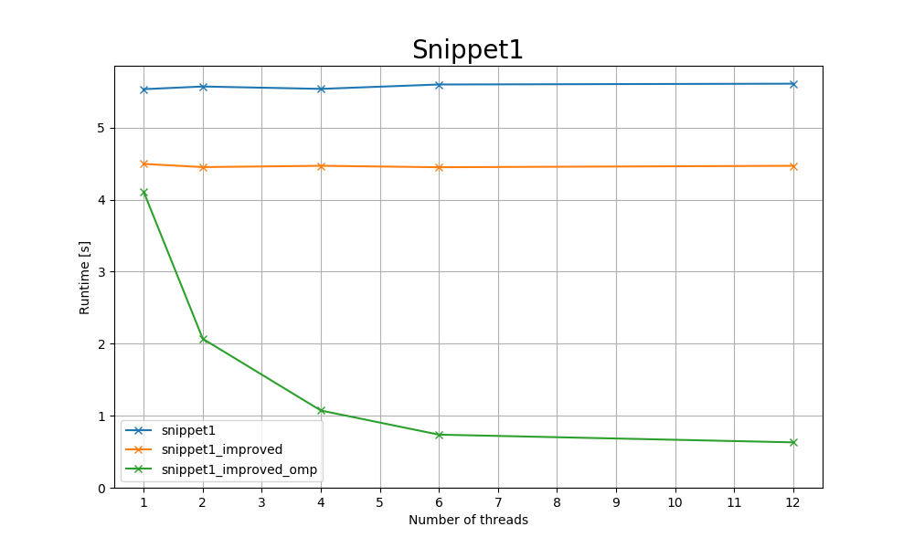
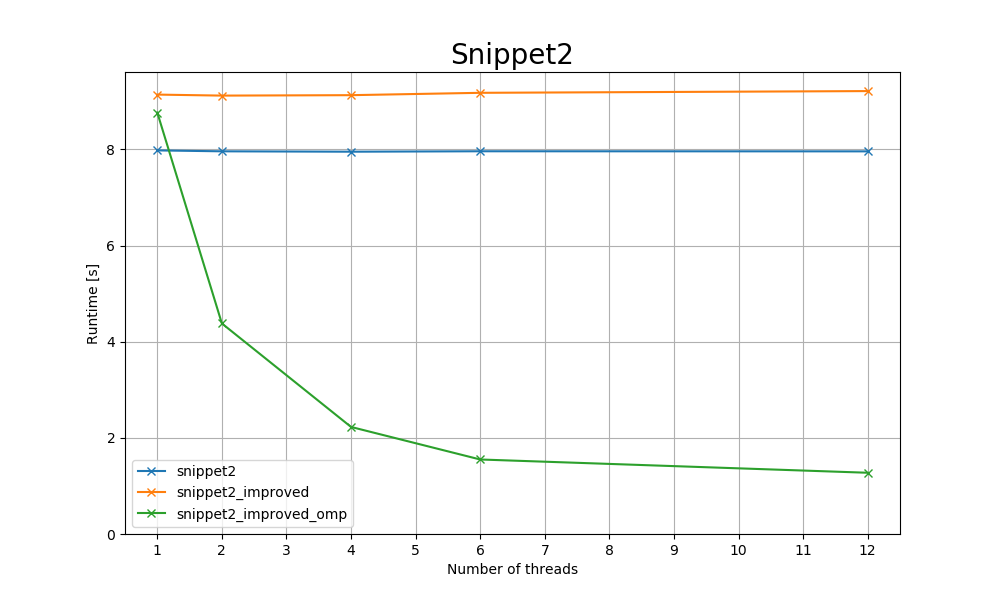
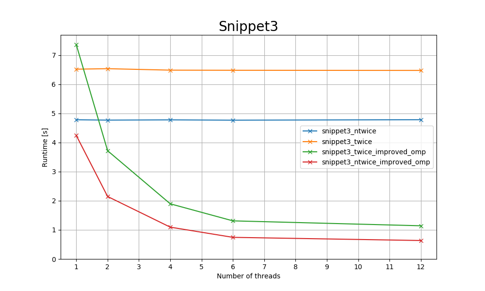

# Task 1

> Where are the data dependencies?


## a) 
```c
double factor = 1;

for (int i=0; i < n; i++) {
    x[i] = factor * y[i]; // S1
    factor = factor / 2; // S2
}
```
D1
| Iter. Vector | Source S1: | Sink S2: factor |
| ------------ | ---------- | --------------- |
| 1            | factor=1   | factor=0.5      |
| 2            | factor=0.5 | factor=0.25     |

(1) - (0) = 1 => (<)

## b) 
```c
for (int i = 1; i<n; i++) {
    x[i] = (x[i] + y[i-1]) / 2; // S1
    y[i] = y[i] + z[i] * 3; // S2
}
```
| Iter | S1: x[i] | S1: y[i-1] | S2: y[i] |
| ---- | -------- | ---------- | -------- |
| 1    | x[1]     | y[0]       | y[1]     |
| 2    | x[2]     | y[1]       | y[2]     |

$S_1 \delta^{-1} S_2$

D1
| Iter. Vector | Source S1: y[i-1] | Sink S2: y[i] |
| ------------ | ----------------- | ------------- |
| 1            | y[0]              | y[1]          |
| 2            | y[1]              | y[2]          |

(2) - (1) = 1 (<) 


## c)
```c
x[0] = x[0] + 5 * y[0]; // S1
for (int i = 1; i<n; i++) {
    x[i] = x[i] + 5 * y[i]; // S2
    if ( twice ) {
        x[i-1] = 2 * x[i-1] // S3, if twice S1 -> S3, S2 -> S3
    }
}
```
**If twice**
| Iter | S1: x[0] | S2: x[i] | S3: x[i -1] |
| ---- | -------- | -------- | ----------- |
| 1    | x[0]     | x[1]     | x[0]        |
| 2    | x[0]     | x[2]     | x[1]        |
| 3    | x[0]     | x[3]     | x[2]        |
| 4    | x[0]     | x[4]     | x[3]        |

$S_2 \delta S_3$

D1
| Iter. | Source S2: x[i] | Sink S3: x[i-1] |
| ----- | --------------- | --------------- |
| 1     | x[1]            |                 |
| 2     | x[2]            | x[1]            |
| 3     |                 | x[2]            |


D2
| Iter. | Source S1: x[0] | Sink S3: x[i-1] |
| ----- | --------------- | --------------- |
| 1     | x[0]            | x[0]            |
| 2     |                 |                 |
| 3     |                 |                 |


## Table

| Loop | Dep | Source     | Type          | Sink       | Dist Vec | Dir Vec | Loop Carried | Loop Ind. | Dependence carried by loop |
| ---- | --- | ---------- | ------------- | ---------- | -------- | ------- | ------------ | --------- | -------------------------- |
| a)   | D1  | S1: factor | $\delta^{-1}$ | S2: factor | (1)      | (<)     | Y            | N         | I-Loop                     |
| b)   | D1  | S1: y[i-1] | $\delta^{-1}$ | S2: y[i]   | (1)      | (<)     | Y            | N         | I-Loop                     |
| c)   | D1  | S2: x[i]   | $\delta$      | S3: x[i-1] | (1)      | (<)     | Y            | N         | I-Loop                     |
| c)   | D2  | S1: x[0]   | $\delta$      | S3: x[0]   | -        | -       | -            | -         | Not applicable             |


a) 
The data dependencie is factor and the loop is anti-dependent
# Task 2

> How can you parallelize the loops?

a) Vie splitting into two loops or Induction Variable Substitution. In this case it's done via Variable Substitution 

b) Split into two for loops 

c) Split into two for loops and put the second for loop in the control flow statement. 


# Task 3

> Implement the original and parallelized versions and compare their wall time for reasonable sizes and numbers of threads.

## a)
| num_threads | snippet1 | snippet1_improved | snippet1_improved_omp |
| ----------- | -------- | ----------------- | --------------------- |
| 1           | 5.534s   | 4.496s            | 4.107s                |
| 2           | 5.571s   | 4.452s            | 2.068s                |
| 4           | 5.538s   | 4.470s            | 1.072s                |
| 6           | 5.599s   | 4.450s            | 0.737s                |
| 12          | 5.610s   | 4.470s            | 0.630s                |


## b) 

| num_threads | snippet2 | snippet2_improved | snippet2_improved_omp |
| ----------- | -------- | ----------------- | --------------------- |
| 1           | 7.980s   | 9.141s            | 8.767s                |
| 2           | 7.961s   | 9.120s            | 4.380s                |
| 4           | 7.953s   | 9.129s            | 2.227s                |
| 6           | 7.962s   | 9.178s            | 1.550s                |
| 12          | 7.960s   | 9.214s            | 1.274s                |


## c)
| num_threads | snippet3_ntwice | snippet3_twice | snippet3_twice_improved_omp | snippet3_ntwice_improved_omp |
| ----------- | --------------- | -------------- | --------------------------- | ---------------------------- |
| 1           | 4.778s          | 6.515s         | 7.355s                      | 4.240s                       |
| 2           | 4.767s          | 6.532s         | 3.716s                      | 2.145s                       |
| 4           | 4.775s          | 6.482s         | 1.894s                      | 1.093s                       |
| 6           | 4.765s          | 6.478s         | 1.309s                      | 0.743s                       |
| 12          | 4.780s          | 6.473s         | 1.140s                      | 0.634s                       |

