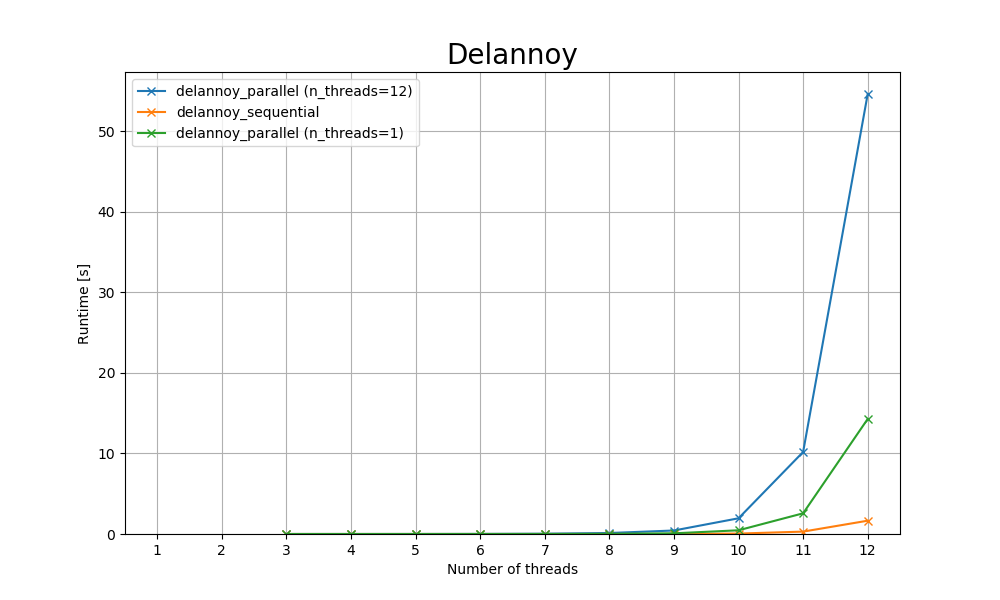

# Task 1

> Implement a sequential program that computes the Delannoy number for a square 2D grid of size NxN where N is an input parameter for your program. If in doubt, base your implementation on the formula given in the Wikipedia article under "basic recurrence relation". Make sure your program is semantically correct by comparing the result against the Delannoy numbers given in the article.

- Done, see [delannoy_sequential.c](delannoy_sequential.c) for the implementation.

# Task 2

> Parallelize your program using OpenMP tasks and benchmark both the sequential and parallel implementation for several N between 3 and ~15. What can you observe?

- Done, see [delannoy_parallel.c](delannoy_parallel.c) for the implementation.
- The Overhead is increasing with the number of threads, which is expected.
- Even when only using one thread the task system is creating overhead.

- The Label for the x-Axis is the size of the grid.

| size | delannoy_parallel (n_threads=12) | delannoy_sequential | delannoy_parallel (n_threads=1) |
| ---- | -------------------------------- | ------------------- | ------------------------------- |
| 3    | 0.001s                           | 0.000s              | 0.000s                          |
| 4    | 0.001s                           | 0.000s              | 0.000s                          |
| 5    | 0.003s                           | 0.000s              | 0.000s                          |
| 6    | 0.011s                           | 0.000s              | 0.001s                          |
| 7    | 0.037s                           | 0.000s              | 0.003s                          |
| 8    | 0.124s                           | 0.002s              | 0.015s                          |
| 9    | 0.434s                           | 0.010s              | 0.085s                          |
| 10   | 1.950s                           | 0.053s              | 0.460s                          |
| 11   | 10.180s                          | 0.296s              | 2.568s                          |
| 12   | 54.605s                          | 1.651s              | 14.280s                         |
# Task 3

> What is the main bottleneck of your parallel implementation and how can it be improved without changing the underlying algorithm?

- Reduce the number of tasks created by increasing the "work" one task do.
- In this case don't use tasks at all, but a simple loop.

# Task 4

> Enter the wall clock time of the sequential version and the parallel version for 1 and 12 threads for N=12 on LCC3 to the comparison spreadsheet linked on Discord.

- Done