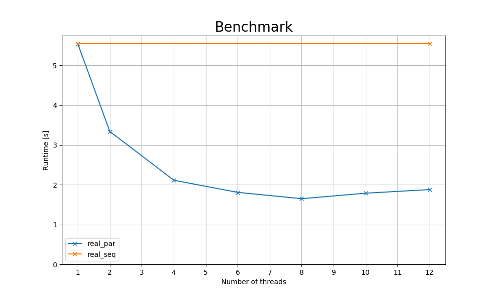

# Task 1

> Investigate any loops that carry larger workloads and determine if and how they can be parallelized. Parallelize them with OpenMP. Ensure that any code modification does not violate program correctness with respect to its output.

Parallelized loops in:

- `psinv`
- `resid`
- `rpr3j`
- `interp`
- `comm3`
- `zero3`

Parallelization of `norm2u3` did not bring any improvements.

See [real_par.c](./real_par.c).

Execute full benchmark by running `make run`. Generate benchmark output with `make result`.

# Task 2

> Benchmark the original, sequential program and your parallelized version for 1, 2, 6 and 12 threads on LCC3, discuss the results and enter the data in the comparison spreadsheet linked on Discord.

| num_threads | real_par | real_seq |
|---|---|---|
| 1 | 5.535s | 5.553s |
| 2 | 3.340s | - |
| 4 | 2.115s | - |
| 6 | 1.809s | - |
| 8 | 1.650s | - |
| 10 | 1.788s | - |
| 12 | 1.879s | 5.553s |

There seems to be a performance decrease after a certain number of threads, likely due to overhead. The performance decrease seems to be caused by the `resid` method. We have not been able to overcome this limitation.