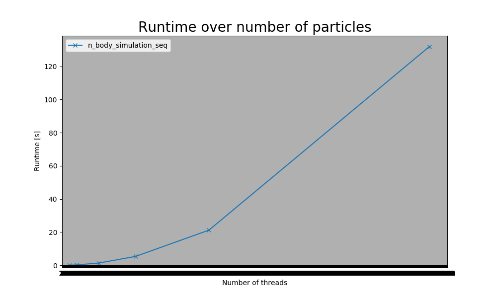
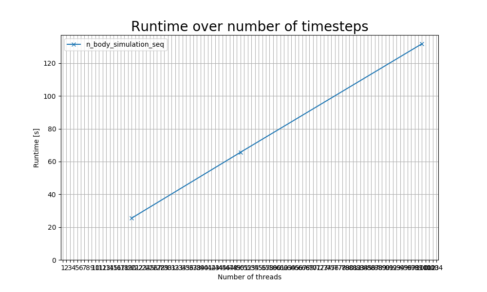
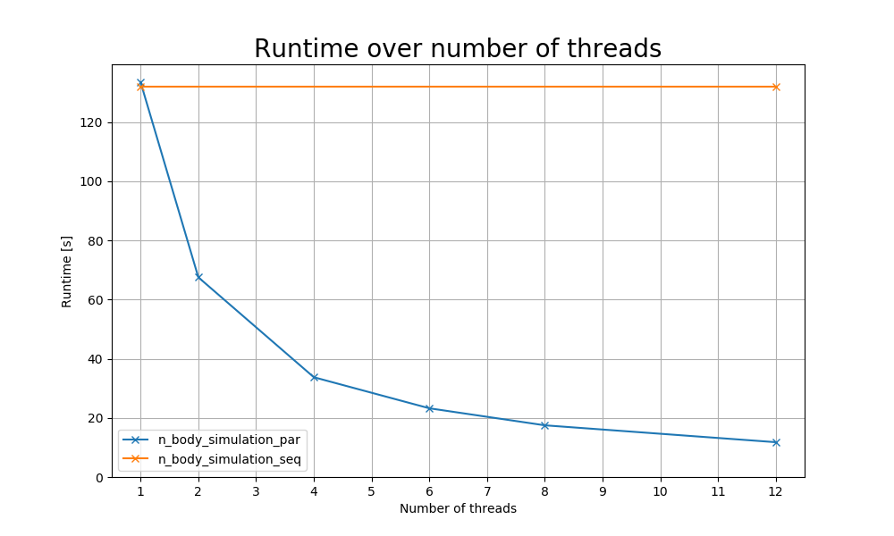

# Description

N-body simulations form a large class of scientific applications, as they are used in research ranging from astrophysics to molecular dynamics. At their core, they model and simulate the interaction of moving particles in physical space. For this assignment, the specific n-body setting relates to astrophysics, where the mutual gravitational effect of stars is investigated. Each particle has several properties which include at least

- position,
- velocity, and
- mass.

For each timestep (you can assume `dt = 1`), particles must be moved by first computing the force exerted on them according to the [Newtonian equation for gravity](https://en.wikipedia.org/wiki/Newton%27s_law_of_universal_gravitation), `force = G * (mass_1 * mass_2) / radius^2` where `G` is the gravitational constant (and can be assumed as `G = 1` for simplicity). Second, using the computed force on a particle, its position and velocity can be updated via `velocity = velocity + force / mass` and `position = position + velocity`.

# Task 1

> Provide a sequential implementation of the n-body simulation in 3D. Hints on how to proceed (not mandatory to follow):
>   1. generate particles randomly, e.g. uniformly distributed
>   2. provide a function for computing forces and moving particles 
>   3. move particles in a time loop for a given number of steps

See [n_body_simulation_seq.c](./n_body_simulation_seq.c)

# Task 2

> Measure the execution time for various particle numbers and timesteps. What can you observe?

## Number of particles

| num_particles | n_body_simulation_seq |
|---|---|
| 100 | 0.053s |
| 200 | 0.211s |
| 500 | 1.322s |
| 1000 | 5.309s |
| 5000 | 131.843s |
| 2000 | 21.168s |

NOTE: X-axis shows number of particles, not number of threads

Runtime grows exponentially with number of particles.

## Number of timesteps

| num_timesteps | n_body_simulation_seq |
|---|---|
| 20 | 25.464s |
| 50 | 65.651s |
| 100 | 131.843s |

NOTE: X-axis shows number of timesteps, not number of threads

Runtime grows linearly with number of timesteps.

# Task 3

> Implement a parallel version the n-body simulation. Optimize your code as much as possible, consider all the optimizations that we discussed in this course. Which optimizations are suitable for this kind of problem? Benchmark your optimized version for multiple numbers of threads and discuss the results.

See [n_body_simulation_par.c](./n_body_simulation_par.c)

| num_threads | n_body_simulation_par | n_body_simulation_seq |
|---|---|---|
| 1 | 133.409s | 131.843s |
| 2 | 67.500s | - |
| 4 | 33.736s | - |
| 6 | 23.238s | - |
| 8 | 17.486s | - |
| 12 | 11.779s | 131.843s |

# Task 4

> Write your data to a file (e.g. `data.dat` ) and use any visualization tool to visualize the movement of the data.

See [data.dat](./data.dat) and [output.gif](./output.gif).

# Task 5

> For measuring performance either disable writing to a datafile or consider not dumping each timestep.
> Benchmark the sequential program and the parallelized version using 5000 particles and 100 time steps for 12 threads on LCC3 and enter the results in the comparison spreadsheet linked on Discord.

Done.